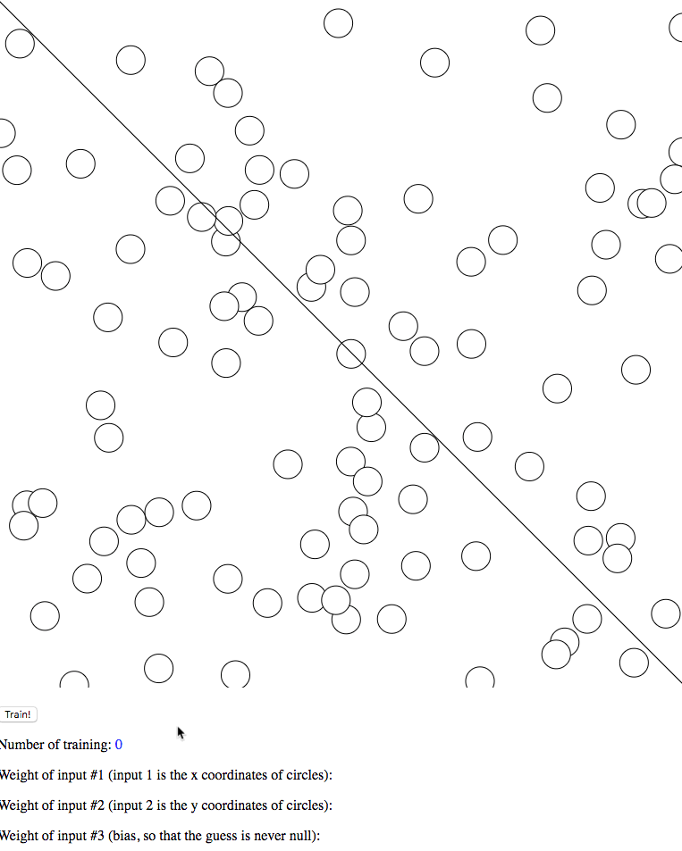

# Perceptron
A simple perceptron with vizualization of the learning process. 
Hit the 'train' button to see it learning how to classify points in a 2D space. 
During the learning process, the moving magenta line represents what the perceptron thinks the solution is. Red cirlces are displayed when the perceptron is guessing wrong and red spikes are also generated. The black line is the solution the perceptron should figure out.

